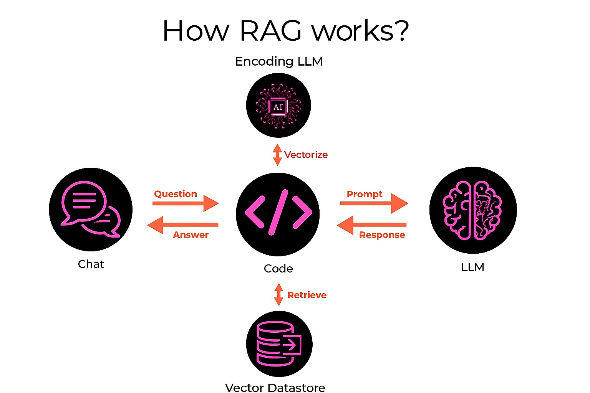

# Readless: Lets RAG our Legislation!

## 1. Overview

This project provides an interactive way to explore and understand complex legislation through a polished, user-friendly chatbot interface. The application uses Retrieval Augmented Generation (RAG) to allow users to quickly understand provisions of "The One Big Beautiful Bill," ask specific questions, and explore its implications in plain language. The chatbot is designed to translate complex legal language into clear, accessible terms that anyone can understand, making legislation more approachable.

The technical foundation of this project is a sophisticated RAG system with several key components: a data processing pipeline that chunks and vectorizes the bill text, a vector store for efficient similarity searching of these embeddings, and a Large Language Model (GPT-4o-mini) that generates clear, accessible explanations based on the retrieved context from the bill.

## 2. What is RAG anyway?

Retrieval Augmented Generation (RAG) is a technique used to enhance the responses of Large Language Models (LLMs) by grounding them in specific, external knowledge. LLMs, while powerful, are trained on vast but general datasets, and their knowledge is fixed at the time of training. This means they might not have information on very specific, niche, or very recent topics, or they might sometimes generate plausible-sounding but incorrect information (a phenomenon known as "hallucination").

RAG addresses this by connecting the LLM to an external knowledge base. Here's a breakdown of a typical RAG process:

1.  **User Input:** The user enters a question or prompt into the chatbot or application.
2.  **Query Vectorization:** The user's input (question) is converted into a numerical representation called a vector embedding. This is typically done using an embedding model, such as one provided by OpenAI or other sentence transformers.
3.  **Context Retrieval:** The vectorized question is then used to search a specialized database (vector store) that contains pre-processed chunks of text from the knowledge base (in this case, the bill text) and their corresponding embeddings. The system retrieves the text chunks whose embeddings are most similar to the question's embedding.
4.  **Prompt Augmentation:** The original user question and the retrieved relevant text chunks (the "context") are combined into a new, augmented prompt. This prompt is then passed to the LLM.
5.  **LLM Response Generation:** The LLM uses the provided context from the retrieved chunks to generate an informed and relevant answer to the user's original question, explaining complex legal concepts in plain language.
6.  **Output to User:** The LLM's response is then passed back to the user through the chatbot interface.

Below is a visual representation of this RAG process:




This approach is crucial because it allows LLMs to provide more accurate, up-to-date, and contextually relevant responses, significantly reducing hallucinations and making them more reliable for specific domains or custom datasets.

## 3. Features

The Ask-a-Bill-Anything Chatbot includes several refined features:

- **Modern, Intuitive Interface:** Clean UI with a clear chat window and organized sidebar navigation
- **Responsive Visual Feedback:** Animated "breathing" dots provide real-time processing feedback
- **Interactive Popular Questions:** Clickable sidebar with pre-loaded sample questions for quick exploration
- **Accessible Explanations:** Complex legal language translated into clear, everyday terms
- **Clean Typography:** Sans-serif fonts make chat dialog easy to read and visually distinct
- **Compact Information Panel:** Collapsible "About" section in the sidebar provides context without clutter
- **Professional Attribution:** Subtle OpenAI attribution tagline at the bottom of the interface
- **Responsive Design:** Well-organized layout that works across different screen sizes
- **Accurate Responses:** All answers are grounded in the actual bill text, not general knowledge

The application consists of three main Python files:

**Script 1: `fetch_doc.py`**
- Handles document acquisition and text extraction
- Robustly fetches bill text from Congress.gov using multiple fallback methods
- Processes and cleans raw HTML into usable plain text

**Script 2: `process_doc.py`**
- Loads the bill text and splits it into semantic chunks
- Creates vector embeddings using OpenAI's embedding model
- Stores these embeddings in a Chroma vector database for efficient retrieval

**Script 3: `rag_chatbot.py`**
- Creates a polished Gradio-based web interface for interacting with the bill
- Implements a RAG pipeline using LangChain and OpenAI's GPT-4o-mini
- Features immediate user feedback with animated processing indicators
- Background thread management for responsive UI during processing
- Consistent bill terminology throughout the interface and responses

### Key Technologies Used:

*   **Langchain:** Langchain is an open-source framework designed to simplify the development of applications powered by large language models (LLMs). It provides tools and abstractions for managing prompts, chaining LLM calls, integrating with external data sources (like vector stores), and creating agents. In this project, Langchain is used for text splitting, managing the LLM (OpenAI's gpt-4o-mini), creating embeddings, and orchestrating the RetrievalQA chain which forms the core of the RAG system. The carefully crafted prompt template ensures consistent, clear responses focused on the bill's content.

*   **Chroma:** Chroma is an open-source embedding database (vector store) designed to store and efficiently search through vector embeddings. When text is converted into embeddings (numerical representations capturing semantic meaning), Chroma allows for fast similarity searches. In this project, after splitting the bill text into chunks and creating embeddings for each chunk, Chroma is used to store these embeddings. When a user asks a question, the RAG system queries Chroma to find the most relevant text chunks from the bill to provide as context to the LLM.

*   **Gradio:** Gradio provides the web interface framework that makes the chatbot accessible through a browser. The implementation includes custom CSS styling, responsive layout with appropriate column scaling, and interactive elements like the clickable sidebar questions and the compact "About" accordion. Custom font settings create visual hierarchy and improve readability throughout the interface.

*   **Threading:** Background threading is implemented for a responsive UI experience, allowing the application to show animated feedback while the LLM processes queries in parallel. This prevents UI freezing during processing and provides immediate visual feedback through the animated "breathing" dots pattern that expands and contracts while the system analyzes the query.

## 4. Setup

To set up the project environment and install all necessary dependencies, run the following command in your terminal:

```bash
pip install -r requirements.txt
```

**Note on API Key:**

You will also need to set your OpenAI API key. There are a few ways to do this:

1.  **Environment Variable (Recommended for Production/Sharing):**
    Set it directly in your shell. This is good for temporary sessions or server environments.
    *   PowerShell: `$Env:OPENAI_API_KEY='your_api_key_here'`
    *   Bash/Zsh: `export OPENAI_API_KEY='your_api_key_here'`

2.  **.env File (Recommended for Local Development):**
    Create a file named `.env` in the root directory of the project (`c:\learn\ml\readless\.env`).
    Add your API key to this file like so:
    ```
    OPENAI_API_KEY='your_actual_api_key_here'
    ```
    The Python scripts (`process_moby_dick.py` and `moby_dick_chatbot.py`) are already configured to look for an `OPENAI_API_KEY` environment variable. To make them automatically load it from the `.env` file, you would typically add a library like `python-dotenv`.

    **IMPORTANT SECURITY NOTE:** Never commit your `.env` file or your API key directly into your version control system (like Git). The provided `.gitignore` file in this project is already configured to ignore `.env` files, preventing accidental check-ins of sensitive credentials.

## 5. Running the Application

The application consists of two main scripts:

### 1. Process the Bill Text

First, process the bill text to create the vector database (if you haven't done this already):

```bash
python process_doc.py
```

This script:
- Loads the bill text from the source file
- Splits the text into semantic chunks
- Creates vector embeddings using OpenAI's embedding model
- Stores these embeddings in a Chroma vector database for efficient retrieval

### 2. Launch the Chatbot Interface

Once the vector database is created, launch the chatbot:

```bash
python rag_chatbot.py
```

This will start a Gradio web interface, typically available at `http://127.0.0.1:7860`.

## 6. Deployment Options

### Temporary Public Link (Up to 72 hours)

For quick demos, modify the launch line in `rag_chatbot.py` to:
```python
demo.launch(share=True)
```

This will generate a public URL that stays active for up to 72 hours, perfect for short-term demos and testing.

### Permanent Hosting Options

For permanent deployment, you have several well-tested options:

#### 1. **Hugging Face Spaces** (Recommended)
The simplest deployment option with minimal setup:

1. **Create a GitHub repository** with your code (including all files in this project)
2. **Sign up** for a [Hugging Face](https://huggingface.co/) account if you don't have one
3. **Create a new Space**:
   - Go to [huggingface.co/new-space](https://huggingface.co/new-space)
   - Select "Gradio" as the SDK
   - Choose a name and set visibility (public or private)
4. **Link to your GitHub repository** in the Space settings
5. **Add your OpenAI API key** as a secret:
   - In your Space settings → Secrets
   - Add a new secret with key `OPENAI_API_KEY` and your API key as the value
6. **Set the following build command** in your Space:
   ```bash
   python process_doc.py && python rag_chatbot.py
   ```

#### 2. **Cloud Providers**
For more control and scalability:

- **Azure App Service**:
  - Deploy as a Python Web App
  - Configure startup command to run both processing and chatbot scripts
  - Add Application Settings for environment variables
  
- **AWS Elastic Beanstalk**:
  - Use the Python platform
  - Configure `.ebextensions` to set up environment variables
  - Include vector database generation in your deployment scripts
  
- **Google Cloud Run**:
  - Create a Dockerfile that sets up the environment
  - Run both scripts in your container startup
  - Set environment variables in the Cloud Run configuration

#### 3. **Custom Server**
For maximum flexibility:

- Install Python 3.9+ on your server
- Clone your repository or upload the files
- Install dependencies: `pip install -r requirements.txt`
- Set up environment variables for your API key
- Run the processing script first: `python process_doc.py`
- Then start the chatbot server: `python rag_chatbot.py`
- Configure a reverse proxy (Nginx/Apache) to expose the Gradio interface
- Consider using systemd, PM2, or similar to keep the service running

**Important Deployment Considerations:**

1. **Security**: Always store your API key securely as an environment variable or secret
2. **Cost Management**: 
   - Monitor your OpenAI API usage, especially for high-traffic deployments
   - Consider implementing rate limiting for public instances
3. **Data Handling**:
   - Ensure the vector database is either included in your deployment or generated on startup
   - For larger bills, you may need to adjust memory allocation in your hosting environment
4. **Updates**:
   - Set up a deployment pipeline for easy updates when improving the application
   - Consider versioning your vector database if the bill text changes

## 7. Latest Improvements

The application has undergone several enhancements to improve user experience and readability:

### User Interface Refinements
- **Sidebar Layout**: Redesigned with clickable popular questions and a compact information panel
- **Typography**: Updated chat dialogs to use a modern sans-serif font stack for better readability
- **Visual Feedback**: Implemented "breathing" animated dots during processing for better user experience
- **Streamlined Experience**: Removed redundant elements like the "Clear Chat" button and chat window label
- **Attribution**: Added a subtle OpenAI attribution footer separated from the main interface

### Responsiveness Improvements
- **Immediate Feedback**: Questions and "thinking" indicators now appear instantly after submission
- **Background Processing**: Enhanced threading implementation keeps the UI responsive during API calls
- **Animation Logic**: Refined animation patterns create a smoother, more professional feel

### Terminology Consistency
- **Bill References**: Updated all system prompts and sample questions to consistently refer to "the bill"
- **Prompt Engineering**: Refined the system prompt to ensure the LLM follows consistent terminology

### Documentation
- **Comprehensive Deployment**: Added detailed deployment instructions for various hosting options
- **Enhanced Feature Documentation**: More detailed explanations of all app capabilities
- **Technical Details**: Added deeper information about implementation choices and patterns

## 8. Conclusion

This Ask-a-Bill-Anything Chatbot demonstrates how RAG technology can make complex legislative documents more accessible to everyone. By combining advanced language models with specialized knowledge retrieval, it creates a powerful tool for understanding complex legal text in straightforward language.

The application is now ready for deployment, with a polished interface and comprehensive documentation. As legislation continues to grow in complexity, tools like this can play a crucial role in maintaining democratic transparency and informed civic participation.
